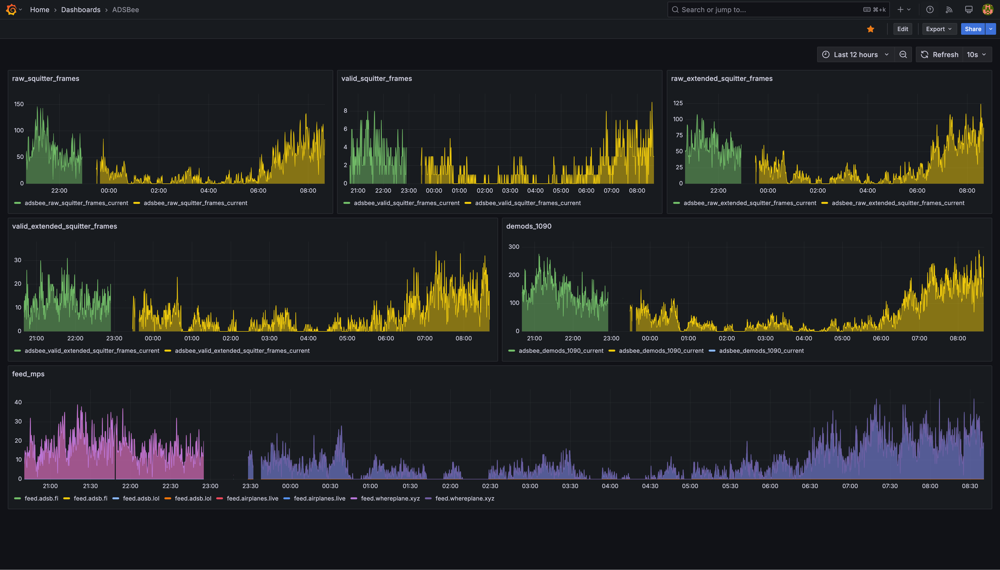

# adsbee-metrics-exporter
Metrics Exporter for ADSBee for use in prometheus.

## Shoutout

Huge thanks to the ADSBee project ([GitHub](https://github.com/CoolNamesAllTaken/adsbee)) and to [pantsforbirds.com](https://www.pantsforbirds.com) for inspiring and enabling this exporter.

## Overview

This is a lightweight Prometheus exporter that consumes ADSBee metrics from a WebSocket and exposes them on an HTTP endpoint for Prometheus scraping.

Prebuilt Docker image on Docker Hub: [bigjuevos/adsbee-metrics-exporter](https://hub.docker.com/r/bigjuevos/adsbee-metrics-exporter) — see the repository page: [Docker Hub repository page](https://hub.docker.com/repository/docker/bigjuevos/adsbee-metrics-exporter).

### Input JSON example

```
{
  "aircraft_dictionary_metrics": {
    "raw_squitter_frames": 84,
    "valid_squitter_frames": 4,
    "raw_extended_squitter_frames": 82,
    "valid_extended_squitter_frames": 18,
    "demods_1090": 192,
    "raw_uat_adsb_frames": 10,
    "valid_uat_adsb_frames": 5,
    "raw_uat_uplink_frames": 3,
    "valid_uat_uplink_frames": 1,
    "num_mode_s_aircraft": 12,
    "num_uat_aircraft": 2,
    "raw_squitter_frames_by_source": [0, 0, 0],
    "valid_squitter_frames_by_source": [0, 0, 0],
    "raw_extended_squitter_frames_by_source": [0, 0, 0],
    "valid_extended_squitter_frames_by_source": [0, 2, 0],
    "demods_1090_by_source": [0, 0, 0]
  },
  "server_metrics": {
    "feed_uri": ["", "", "", "", "", "", "feed.whereplane.xyz", "feed.adsb.lol", "feed.airplanes.live", "feed.adsb.fi"],
    "feed_mps": [0, 0, 0, 0, 0, 0, 23, 0, 23, 0]
  },
  "device_status": {
    "rp2040": {
      "uptime_ms": 123456789,
      "core_usage_percent": [45.2, 30.1],
      "temperature_deg_c": 42.5
    },
    "esp32": {
      "uptime_ms": 123456000,
      "core_usage_percent": [55.0, 40.0],
      "temperature_deg_c": 48.3,
      "heap_free_bytes": 102400,
      "heap_largest_free_block_bytes": 65536
    }
  }
}
```

### Exported metrics

**Aircraft dictionary metrics:**

- `adsbee_raw_squitter_frames_current` (Gauge)
- `adsbee_valid_squitter_frames_current` (Gauge)
- `adsbee_raw_extended_squitter_frames_current` (Gauge)
- `adsbee_valid_extended_squitter_frames_current` (Gauge)
- `adsbee_demods_1090_current` (Gauge)
- `adsbee_raw_uat_adsb_frames_current` (Gauge)
- `adsbee_valid_uat_adsb_frames_current` (Gauge)
- `adsbee_raw_uat_uplink_frames_current` (Gauge)
- `adsbee_valid_uat_uplink_frames_current` (Gauge)
- `adsbee_num_mode_s_aircraft_current` (Gauge)
- `adsbee_num_uat_aircraft_current` (Gauge)

**Server metrics:**

- `adsbee_feed_mps{feed_uri}` (Gauge) — exported only for non-empty `feed_uri` entries

**Device status metrics** (labeled by `device` — e.g. `rp2040`, `subg`, `esp32`):

- `adsbee_device_uptime_seconds{device}` (Gauge) — uptime converted from ms to seconds
- `adsbee_device_core_usage_percent{device, core}` (Gauge) — CPU core usage
- `adsbee_device_temperature_deg_c{device}` (Gauge) — temperature in degrees Celsius
- `adsbee_device_heap_free_bytes{device}` (Gauge) — heap free bytes (esp32 only)
- `adsbee_device_heap_largest_free_block_bytes{device}` (Gauge) — largest free block (esp32 only)

All new metrics are backwards-compatible: old firmware payloads that omit the new fields will simply not populate these gauges.

## Configuration

Environment variables:

- `WS_URL` (required): WebSocket URL to consume metrics from. Example: `ws://host:port/metrics`
- `EXPORTER_PORT` (default: `9100`): HTTP port to expose metrics on.
- `RECONNECT_MIN_SECONDS` (default: `1`): Initial reconnect backoff.
- `RECONNECT_MAX_SECONDS` (default: `30`): Max reconnect backoff.
- `CONNECT_TIMEOUT_SECONDS` (default: `10`): WebSocket connect timeout.
- `RECEIVE_TIMEOUT_SECONDS` (default: `30`, set to `None` to disable): Receive timeout; on timeout, the exporter pings and continues or reconnects if ping fails.
- `LOG_LEVEL` (default: `INFO`): Logging level.

## Running locally

```
python3 -m venv .venv
source .venv/bin/activate
pip install -r requirements.txt
export WS_URL="ws://your-adsbee-host:80/metrics"
python exporter.py
```

Prometheus metrics will be available at `http://localhost:9100/` (path `/metrics`).

## Docker

Pull (recommended):

```
docker pull bigjuevos/adsbee-metrics-exporter:latest
```

Run:

```
docker run --rm -p 9100:9100 \
  -e WS_URL="ws://your-adsbee-host:80/metrics" \
  -e EXPORTER_PORT=9100 \
  bigjuevos/adsbee-metrics-exporter:latest
```

Build locally (optional):

```
docker build -t adsbee-metrics-exporter:latest .
```

## Docker Compose

This repository includes a `docker-compose.yml` that pulls the published image by default. To build locally instead, uncomment the `build` section inside `docker-compose.yml`.

### Quick start

From the project root:

```bash
docker compose up -d
```

Then visit `http://localhost:9100/metrics`.

By default, the container listens on port `9100` and the exporter connects to `ws://host.docker.internal:8080/metrics` (suitable for macOS/Windows when the ADSBee source runs on the host). On Linux, adjust `WS_URL` to point at your ADSBee source.

### Configuration

You can configure the exporter by setting environment variables before running compose, or by creating a `.env` file in the project root.

- Inline environment variables:

```bash
WS_URL="ws://your-adsbee-host:80/metrics" \
EXPORTER_PORT=9100 \
docker compose up -d
```

- Using a `.env` file (create one alongside `docker-compose.yml`):

```env
# WebSocket source for ADSBee metrics
WS_URL=ws://your-adsbee-host:80/metrics

# Host port to expose (container always listens on 9100)
EXPORTER_PORT=9100

# Optional tuning
LOG_LEVEL=INFO
RECONNECT_MIN_SECONDS=1
RECONNECT_MAX_SECONDS=30
CONNECT_TIMEOUT_SECONDS=10
RECEIVE_TIMEOUT_SECONDS=30
```

Then run:

```bash
docker compose up -d
```

## Grafana dashboard

If you're using Prometheus with Grafana, a ready-to-import dashboard is provided at `grafana-dashboard.json`.



### Importing into Grafana

1. In Grafana, go to Dashboards → Import.
2. Upload the `grafana-dashboard.json` file (or paste its JSON).
3. When prompted, select your Prometheus data source.
4. Click Import.

The dashboard visualizes the exported metrics listed above and should work once Prometheus is scraping this exporter.
